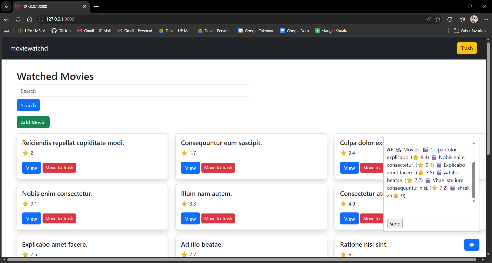
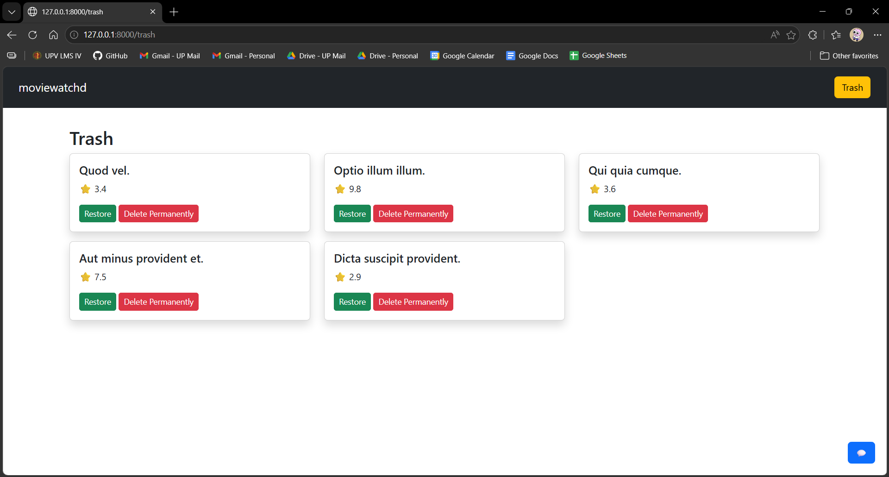

# moviewatchd

## 📌 Application Description and Purpose
moviewtachd is a Laravel-based web application that allows users to track movies they have watched. Users can rate movies, leave comments, upload posters, categorize them, and manage the list efficiently. The purpose of this application is to provide a user-friendly interface to keep a personal movie journal with advanced features like search, filters, soft delete, and restore.

---

## 🛠️ Installation and Setup Instructions
1. Clone the repository:
```bash
git clone https://github.com/jul00/CMSC129-Lab2-BretanaJ.git
cd moviewatchd
```

2. Install dependencies:
```bash
composer install
```

3. Copy `.env` file and set up database credentials:
```bash
cp .env.example .env
```
Edit `.env`:
```
DB_CONNECTION=pgsql
DB_HOST=127.0.0.1
DB_PORT=5432
DB_DATABASE=moviewatchd_db
DB_USERNAME=postgres
DB_PASSWORD=yourpassword
```

4. Generate application key:
```bash
php artisan key:generate
```

5. Create symbolic link for storage (required for poster images):
```bash
php artisan storage:link
```

6. Run migrations and seeders:
```bash
php artisan migrate --seed
```

7. Serve the application:
```bash
php artisan serve
```
Open your browser at `http://127.0.0.1:8000`

---

## 🗄️ Database Setup Guide
- Install PostgreSQL locally or use a cloud service (Supabase/ElephantSQL).
- Create a database:
```sql
CREATE DATABASE moviewatchd_db;
```
- Update `.env` file with your credentials.

### Tables Created
- **movies**: stores movie information, ratings, comments, poster image path, category, timestamps, and soft delete.
- **categories**: stores movie categories.

---

## ⚡ Migration Commands
```bash
php artisan migrate        # Run all migrations
php artisan migrate:fresh  # Drops all tables and re-migrates
php artisan db:seed        # Populate database with sample data
```

---

## 🖼️ Screenshots of the Application


---

## ✅ Features Implemented
- Full CRUD operations (Create, Read, Update, Delete)
- Soft delete and restore functionality
- Movie poster image upload with validation
- Search and filter by title, genre, rating
- Movie categorization using Eloquent relationships
- Responsive UI using Bootstrap
- Card-based layout with modals and hover animations
- Database seeding with Faker for sample movies

---

## 🧩 MVC Architecture Explanation

### Models
- **Movie.php**: Represents movies and handles relationships with categories.
- **Category.php**: Represents categories, linked to movies.

### Views (Blade Templates)
- `layouts/app.blade.php`: Master layout with navbar and yield sections.
- `movies/index.blade.php`: Homepage listing movies in cards with search/filter.
- `movies/create.blade.php`: Form to add a new movie.
- `movies/edit.blade.php`: Form to edit an existing movie.
- `movies/trash.blade.php`: Shows soft-deleted movies with restore/hard delete.
- Uses Bootstrap for responsiveness, modals, and cards.

### Controllers
- **MovieController.php**: Handles all business logic between models and views:
  - Index, show, create, store, edit, update, destroy
  - Trash, restore, forceDelete
  - Search and filter queries

### Project Structure
```
app/
 ├── Models/
 │    ├── Movie.php          # Eloquent model for movies
 │    └── Category.php       # Eloquent model for categories
 ├── Http/Controllers/
 │    └── MovieController.php # Handles all CRUD + extra features

resources/views/
 ├── layouts/
 │    └── app.blade.php      # Master layout
 └── movies/
      ├── index.blade.php    # Movie cards view
      ├── create.blade.php   # Add movie form
      ├── edit.blade.php     # Edit movie form
      ├── show.blade.php     # Single movie details (if needed)
      └── trash.blade.php    # Soft deleted movies
```

Comments are added in the code to explain validations, relationships, and storage usage.

---

## 🤖 AI Assistant Integration (Gemini API)

This project includes an **AI-powered chatbot assistant** using Google Gemini API that allows users to manage movies using natural language.

### 🧠 AI Capabilities
The assistant can:
- Add new movies using natural language
- Update existing movie details
- Delete movies with confirmation
- Search and retrieve movie information
- Provide conversational responses with context awareness

---

### 🪛 Setup Instructions

## 1. Get API Key
  Get your key from:
  https://ai.google.dev/gemini-api

## 2. Add to .env
  GEMINI_API_KEY=your_api_key_here  

## 3. Run migrations
  ```bash
  php artisan migrate
  ```

## 4. Run server
  ```bash
  php artisan serve 
  ```

### 💬 Example AI Commands
- "Add a movie called Inception rated 5 with great visuals"
- "Update Interstellar rating to 4.5"
- "Delete The Batman"
- "Show me all movies I added recently"

---
## ⚙️ How It Works

1. User sends a message via chat UI  
2. Laravel sends:
   - Chat history (session-based)
   - Movie database (JSON format)
   - User prompt  
   to Gemini API  
3. Gemini returns structured JSON  
4. Laravel parses JSON and executes actions  
5. Response is returned to frontend  

---

### ⚙️ AI Intent System (Core Logic)

The AI converts user input into structured JSON:

```json
{
  "action": "create | update | delete | read | none",
  "title": "movie title",
  "rating": 5,
  "comment": "optional comment"
}
```

## 🧠 AI Response Format

The AI must return **ONLY valid JSON**:

```json
{
  "action": "create | read | update | delete | history | none",
  "id": 1,
  "title": "Movie Title",
  "rating": 5,
  "min_rating": 4,
  "max_rating": 10,
  "comment": "Optional comment"
}